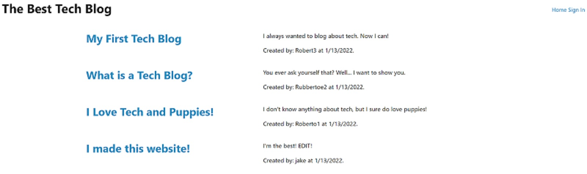
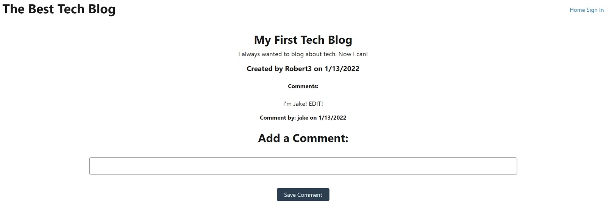
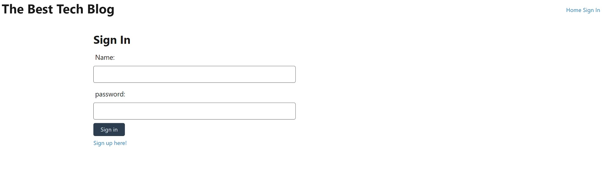
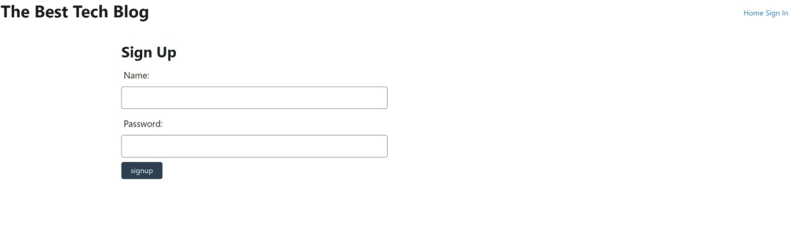
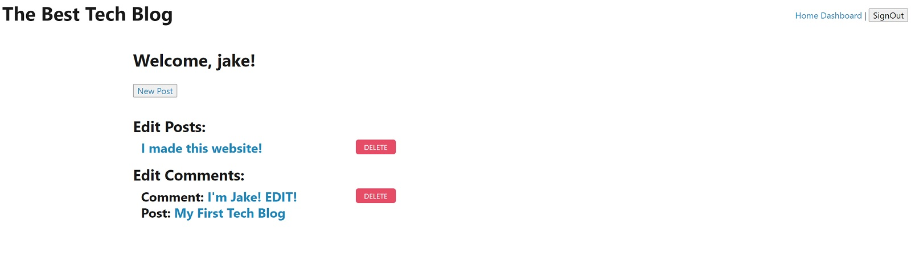
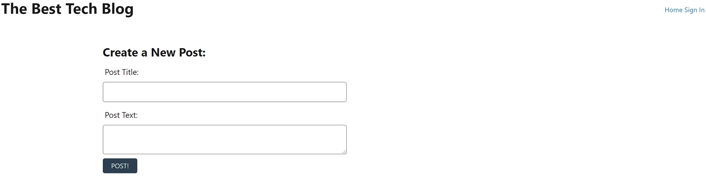
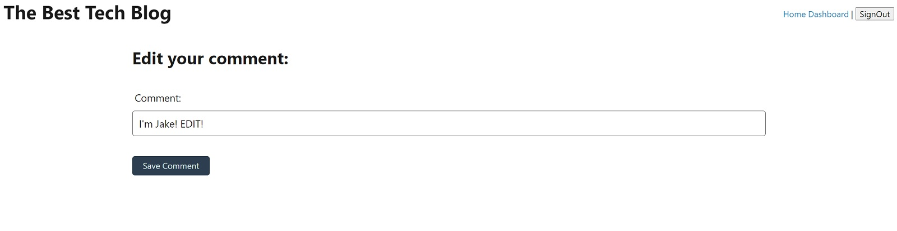

# The Best Tech Blog

## Description
I made the Best Tech BLog.

Write about what you love about tech best using the Best Tech Blog. Write, comment, and express yourself, but remember to keep it tech related!

Enjoy!

GitHub Repository: [https://github.com/jhur628/the-best-tech-blog](https://github.com/jhur628/the-best-tech-blog)

Deployed Application: [https://the-best-tech-blog.herokuapp.com/](https://the-best-tech-blog.herokuapp.com/)

## Table of Contents
1. [Installation](#Installation)
2. [Usage](#Usage)
3. [Credits](#Credits)
4. [Questions](#Questions)
5. [Screenshots](#Screenshots)
6. [License](#License)

## Installation
No installation required. The application is deployed on Heroku.
## Usage
When the user visits the URL, the user will be welcomed to a homepage. The homepage will show blog posts(title, post, user, date created). When the user clicks on the title of a blog post, the user will be sent to a page with the individual blog post. The post page will include the title, post, user, date created, comments(comment, user commented, date created), and an input field where users may leave a comment on the post if they are signed in.

When the user clicks the home link on the nav bar, the user will be returned to the homepage.

When the user clicks the sign in link on the nav bar, the user is taken to the sign in page. The user may sign in, which will take the user to the dashboard page. The user may also sign up with the link at the bottom of the sign in page. Once the user has signed up, the user will be taken to the dashboard.

When the user is at the dashboard page, the user may make a new post, edit/delete a post, or edit/delete a comment.

When the user clicks the sign out button on the nav bar, the user will be signed out and sent to the homepage.

When the user's session will be timed out after a day, and the user will signed out of their account.
## Credits
A lot of credit to my instructor, TAs, and my study group. I don't think I could have done this one alone. Thank you!
## Questions
Have any questions?  
Contact me at hur.john628.com.  
Github: https://github.com/jhur628/  
## Screenshots

## License
MIT   For more information on the MIT license, visit: https://opensource.org/licenses/MIT